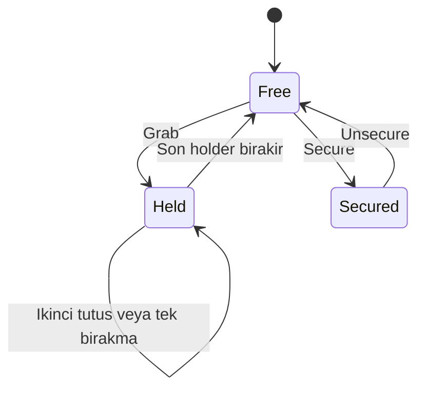

# Eşya semantiği ve değişmezler

## Bir enum yeterli değil
Eşya üç ayrı eksende modellenir: yaşam döngüsü Available / Delivered / Lost; taşıma durumu Free / Held / Secured; integrity 0–100. Hasarlı olmak ayrıca taşıma durumunu değiştirmez. Kırık veya teslim edilmiş eşyanın holder'ı bulunamaz.

| Olay | Önkoşul | Sonuç |
|---|---|---|
| Grab | Available; Free/Held; boş yuva | Held; holder ekle |
| Release | İstekte bulunan mevcut holder | Son holder ise Free |
| Secure | Available + Free + geçerli platform | Secured; anchor kaydı |
| Unsecure | Available + Secured + güvenli vinç | Free; anchor kaldır |
| Deliver | Available + Free + bölge koşulları | Delivered; ödül olayı bir kez |
| IntegrityZero | Available ve integrity=0 | Lost; bağlantıları temizle |
| Recovery | Available; kurtarma hakkı var | Free; güvenli konuma al |

## Değişmezler
Delivered ve Lost terminaldir; aynı ContractRun içinde geri Available yapılamaz. Held durumunda 1–2 holder vardır. Free durumunda holder ve anchor yoktur. Secured durumunda holder yok, tam bir platform anchor ilişkisi vardır. Integrity negatif olamaz. Delivered nesnenin fiziksel collider'ı oyunda teslimat sonrası nasıl kaldırılırsa kaldırılsın kimliği sonuç kayıtlarında korunur. Mesh veya GameObject adı kalıcı item kimliği değildir.

## Durum kaydı
Önerilen alanlar: itemInstanceId, definitionId, lifecycle, handling, integrity, revision, holderIds, platformId/anchorId, recoveryCount, pose, linear/angular velocity. Bu alanların hepsi her ağ paketinde gönderilmez; semantik durum ile yüksek frekanslı pose çoğaltması ayrılır. Shared physics host üzerinde; yerel eller ve kozmetik efektler türetilmiştir.

## Atomik işlem
StateStore değişikliği tek uygulama sınırından yapılır. GrabJoint oluşturulması başarısızsa holder kaydı geri alınır; yarım Held durumu bırakılamaz. Deliver geçişi, teslimat defterine item kimliği eklenmesiyle aynı domain işleminde olur. Kayıt diske tur sonunda ayrı güvenilir sınırla gider.

## Yasak kombinasyon örnekleri
Delivered + Held; Lost + anchor; üç holder; iki farklı platforma Secured; Free ama kalan joint; integrity sıfır ama Available. Geliştirme build'inde invariant denetimi bu durumları görünür raporlar. Shipping build kendi kendine para ekleyerek durumu “düzeltmez”; güvenli cleanup ve hata kaydı gerekir.

## Kabul
Bütün geçerli geçişler ve yasak kombinasyonlar saf domain testinde kapsanır. Görsel model gizlense de durumun doğruluğu test edilebilir. Çökme veya kopma temizliği normal oyuncu komutlarının aynı kurallarını kullanır, bağımsız ikinci kural seti yaratmaz.

## Durum diyagramı — taşıma ekseni

Bu diyagram yalnız Available yaşam döngüsü içindeki taşıma eksenini gösterir. Delivered/Lost geçişleri ayrıca terminal cleanup uygular; diyagramdan eksik yaşam döngüsü kuralı türetilmez.

## Gereksinim ve test izleri
- REQ-009 → TC-009 — Eşya değişmezleri korunmalı

Durum ve ayrıntılı adımlar: [gereksinim kayıtları](../../data/requirements.json) ve [test kayıtları](../../data/test_cases.json). Oyun testleri henüz çalıştırılmadı.

## İlgili kaynak belgeler
- [ASK-015 — Etkileşim sorgusu ve komut sözleşmesi](015_interaction_contract.md)
- [ASK-017 — Ortak taşıma ve kuvvet modeli](017_shared_carrying.md)
- [ASK-020 — Sabitleme, kayış ve anchor sözleşmesi](020_straps_anchors.md)
- [ASK-021 — Hasar ve kontrollü kırılma](021_damage_breakage.md)
- [ASK-022 — Teslimat doğrulaması ve tek seferlik sonuç](022_delivery_scoring.md)
- [ASK-025 — Düşme, sıkışma ve kurtarma kuralları](025_recovery_failures.md)

